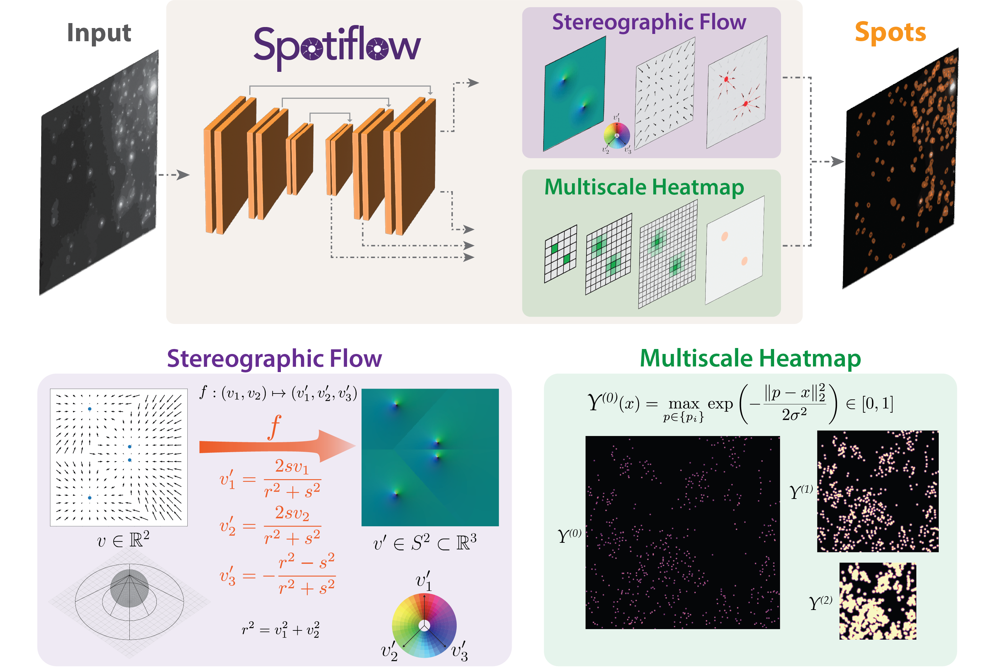

[](https://opensource.org/license/bsd-3-clause)
[](https://pypi.org/project/spotiflow)
[](https://python.org)
[](https://pepy.tech/projects/spotiflow)
[](https://github.com/weigertlab/spotiflow/actions)


---


# Spotiflow - accurate and efficient spot detection with stereographic flow

*Spotiflow* is a deep learning-based, threshold-agnostic, subpixel-accurate 2D and 3D spot detection method for fluorescence microscopy. It is primarily developed for spatial transcriptomics workflows that require transcript detection in large, multiplexed FISH-images, although it can also be used to detect spot-like structures in general fluorescence microscopy images and volumes. A more detailed description of the method can be found in [the publication](https://doi.org/10.1038/s41592-025-02662-x) and [the preprint](https://doi.org/10.1101/2024.02.01.578426).



The documentation of the software can be found [here](https://weigertlab.github.io/spotiflow/).

## Installation (pip, recommended)
Create and activate a fresh conda environment (we currently support Python 3.9 to 3.14):

```console
conda create -n spotiflow python=3.12
conda activate spotiflow
```

Then install PyTorch using `pip`:

```console
pip install torch
```

**Note (for Linux/Windows users with a CUDA-capable GPU):** one might need to change the `torch` installation command depending on the CUDA version. Please refer to the [PyTorch website](https://pytorch.org/get-started/locally/) for more information.


**Note (for Windows users):** if using Windows, please install the latest [Build Tools for Visual Studio](https://visualstudio.microsoft.com/downloads/#build-tools-for-visual-studio-2022) (make sure to select the C++ build tools during installation) before proceeding to install Spotiflow.

Finally, install `spotiflow`:

```console
pip install spotiflow
```

## Installation (conda)
For Linux/MacOS users, you can also install Spotiflow using conda through the `conda-forge` channel:

```console
conda install -c conda-forge spotiflow
```

Note that the `conda-forge` Spotiflow version might be outdated w.r.t. the version in `pip`. We recommend using `pip` to install Spotiflow if available.

## Usage

### Training
The CLI is the easiest way to train (or fine-tune) a model. To train a model, you can use the following command:

```console
spotiflow-train INPUT_DIR -o OUTPUT_DIR
```

where `INPUT_DIR` is the path to the directory containing the data in the format described [here](https://weigertlab.github.io/spotiflow/train.html) and `OUTPUT_DIR` is the directory where the trained model will be saved. You can also pass other parameters to the training, such as the number of epochs, the learning rate, etc. For more information, including examples, please refer to the [training documentation](https://weigertlab.github.io/spotiflow/train.html) or run the command `spotiflow-train --help`.

For training with the API, please check the [training example notebook](examples/1_train.ipynb). For finetuning an already pretrained model, please refer to the [finetuning example notebook](examples/3_finetune.ipynb).

#### 3D models
3D models can also be trained with the CLI by adding the `--is-3d True` flag, as shown below:

```console
spotiflow-train INPUT_DIR -o OUTPUT_DIR --3d True
```

See the [example 3D training script](scripts/train_simple_3d.py) for an API example. For more information, please refer to the [3D training example notebook](examples/4_train_3d.ipynb). Fine-tuning a 3D model can be done by following the same workflow as to the 2D case.

### Inference (CLI)

You can use the CLI to run inference on an image or folder containing several images. To do that, you can use the following command:

```console
spotiflow-predict PATH
```

where PATH can be either an image or a folder. By default, the command will use the `general` pretrained model. You can specify a different model by using the `--pretrained-model` flag. Moreover, spots are saved to a subfolder `spotiflow_results` created inside the input folder (this can be changed with the `--out-dir` flag). For more information, please refer to the help message of the CLI (`$ spotiflow-predict -h`).

### Inference (API)

The API allows detecting spots in a new image in a few lines of code! Please check the [corresponding example notebook](examples/2_inference.ipynb) and the documentation for a more in-depth explanation. The same procedure can be followed for 3D volumes.

```python
from spotiflow.model import Spotiflow
from spotiflow.sample_data import test_image_hybiss_2d

# Load sample image
img = test_image_hybiss_2d()
# Or any other image
# img = tifffile.imread("myimage.tif")

# Load a pretrained model
model = Spotiflow.from_pretrained("general")
# Or load your own trained model from folder
# model = Spotiflow.from_folder("./mymodel")

# Predict
points, details = model.predict(img) # points contains the coordinates of the detected spots, the attributes 'heatmap' and 'flow' of `details` contain the predicted full resolution heatmap and the prediction of the stereographic flow respectively (access them by `details.heatmap` or `details.flow`). Retrieved spot intensities are found in `details.intens`.
```

### Inference (Docker)

Alternatively to installing Spotiflow as a command line tool on your operating system, you can also use it directly from a Docker container (thanks to [@migueLib](https://github.com/migueLib) for the contribution!). To do so, you should:

1) Pull the Docker container from Dockerhub:
``` console
docker pull weigertlab/spotiflow:main
```

2) Run `spotiflow-predict` in the container with:
```console
docker run -it -v [/local/input/folder]:/spotiflow/input weigertlab/spotiflow:main spotiflow-predict input/your_file.tif -o .
```
Where `-v` is the volume flag, which allows you to mount a folder from your local machine to the container. `[/local/input/folder]` should be the path to the folder containing the image(s) you want to analyze.

Note that the current implementation of Spotiflow in Docker only supports CPU inference.

### Napari plugin
Our napari plugin allows detecting spots in 2D and 3D directly with an easy-to-use UI. See [napari-spotiflow](https://github.com/weigertlab/napari-spotiflow) for more information.

### QuPath extension
[Rémy Dornier](https://github.com/rdornier) and colleagues at the [BIOP](https://github.com/BIOP) built an extension to run Spotiflow (prediction only) in QuPath. Please [check their repository](https://github.com/BIOP/qupath-extension-spotiflow) for documentation and installation instructions.

### Fiji/TrackMate
[Jean-Yves Tinevez](https://github.com/tinevez) integrated Spotiflow in the [v8 release](https://forum.image.sc/t/trackmate-v8-segmentation-editor-and-python-cli-integration/117737) of [TrackMate](https://imagej.net/plugins/trackmate)! To use it you must install Spotiflow in a conda environment as described above, and then follow [these instructions](https://imagej.net/plugins/trackmate/trackers/trackmate-trackastra#configure-conda-path-in-fiji) to configure TrackMate to use that conda environment.

### Available pre-trained models
We provide several pre-trained models that may be used out-of-the-box. The available models are: `general`, `hybiss`, `synth_complex`, `fluo_live`, `synth_3d` and `smfish_3d`. For more information on these pre-trained models, please refer to the article and the [documentation](https://weigertlab.github.io/spotiflow/pretrained.html).

### Changing the cache directory
The default cache directory root folder (where pre-trained models and datasets are stored) is, by default, `~/.spotiflow`. If you want to change it for your use case, you can either set the environment variable `SPOTIFLOW_CACHE_DIR` to the path you want or directly pass the desired folder as an argument (`cache_dir`) to the `Spotiflow.from_pretrained()` method (note that if the latter is chosen, the path stored in the environment variable will be ignored). 


## Starfish integration

Spotiflow can be seamlessly integrated in existing Starfish pipelines using our ```spotiflow.starfish.SpotiflowDetector``` as a spot detection method instead of the `BlobDetection` classes shipped with Starfish, requiring minimal code changes apart from the addition of Spotiflow to the existing environment where Starfish is installed. For an example, please refer to [the provided script](extra/run_starfish_spotiflow.py).

## For developers

We are open to contributions, and we indeed very much encourage them! Make sure that existing tests pass before submitting a PR, as well as adding new tests/updating the documentation accordingly for new features.

### Testing

First, clone the repository:
```console
git clone git@github.com:weigertlab/spotiflow.git
```

Then install the `testing` extras:

```console
cd spotiflow
pip install -e ".[testing]"
```

then run the tests:

```console
pytest -v --color=yes --cov=spotiflow
```

### Docs

Install the `docs` extras:

```console
pip install -e ".[docs]"
```

and then `cd` into the `docs` folder of the cloned repository and build them:
```console
cd spotiflow/docs
sphinx-build -M html source build
```

## How to cite
If you use this code in your research, please cite [the Spotiflow publication](https://doi.org/10.1038/s41592-025-02662-x):

```bibtex
@article{dominguezmantes25,
    title = {Spotiflow: accurate and efficient spot detection for fluorescence microscopy with deep stereographic flow regression},
    author = {Dominguez Mantes, Albert and Herrera, Antonio and Khven, Irina and Schlaeppi, Anjalie and Kyriacou, Eftychia and Tsissios, Georgios and Skoufa, Evangelia and Santangeli, Luca and Buglakova, Elena and Durmus, Emine Berna and Manley, Suliana and Kreshuk, Anna and Arendt, Detlev and Aztekin, Can and Lingner, Joachim and La Manno, Gioele and Weigert, Martin},
    year = {2025},
    journal = {Nature Methods},
    isbn = {1548-7105},
    doi = {10.1038/s41592-025-02662-x},
    url = {https://doi.org/10.1038/s41592-025-02662-x},
}
```
