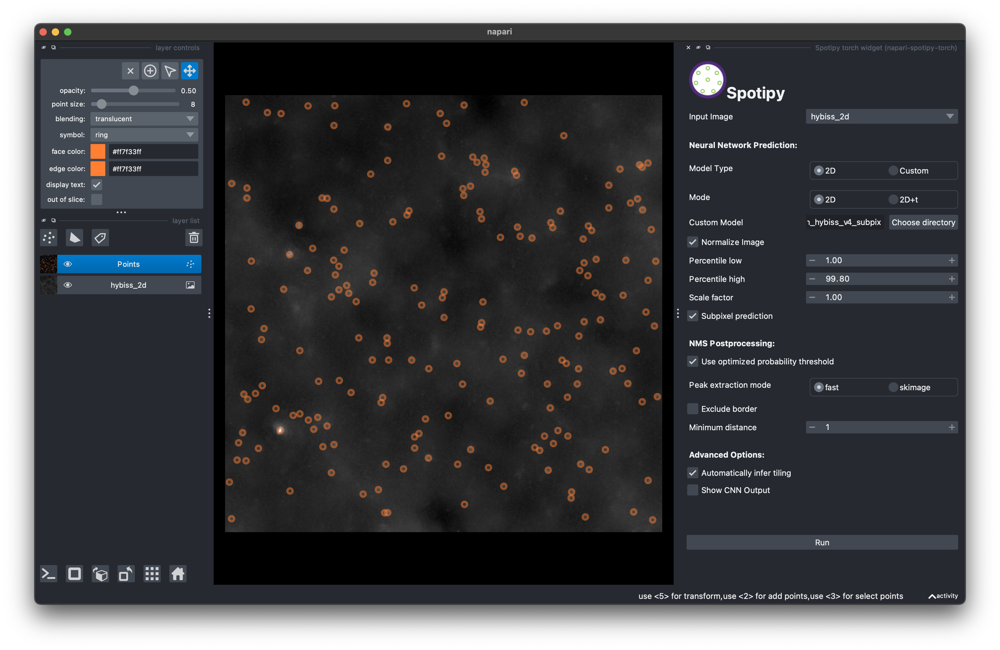

Predicting spots using the napari plugin
----------------------------------------

The napari plugin can be used to predict spots in a napari viewer. First, you must install it in the environment containing Spotipy:

.. code-block:: console

    (spotipy) $ pip install napari-spotipy

The plugin will then be available in the napari GUI under the name "Spotipy widget". This is how the GUI looks like:

.. image:: ./_static/spotipy_napari_gui.png
    :width: 700
    :align: center

The plugin has two modes: for images (``2D``) and movies (``2D+t``), which can be toggled using the ``2D`` and ``2D+t`` buttons in the GUI. Other options can be tuned, `e.g.` rescaling the image.

Upon pressing the button ``Run``, The plugin will create a ``Points`` layer containing the predicted spots:

If the option ``Show CNN output`` is checked, the plugin will also create an ``Image`` layer containing the heatmap output of the CNN.

Finally, the plugin includes one sample image per dataset. These samples can be loaded from the ``File`` menu (``File -> Open sample -> napari-spotipy``). You can try the plugin with these samples to get a better idea of how it works!