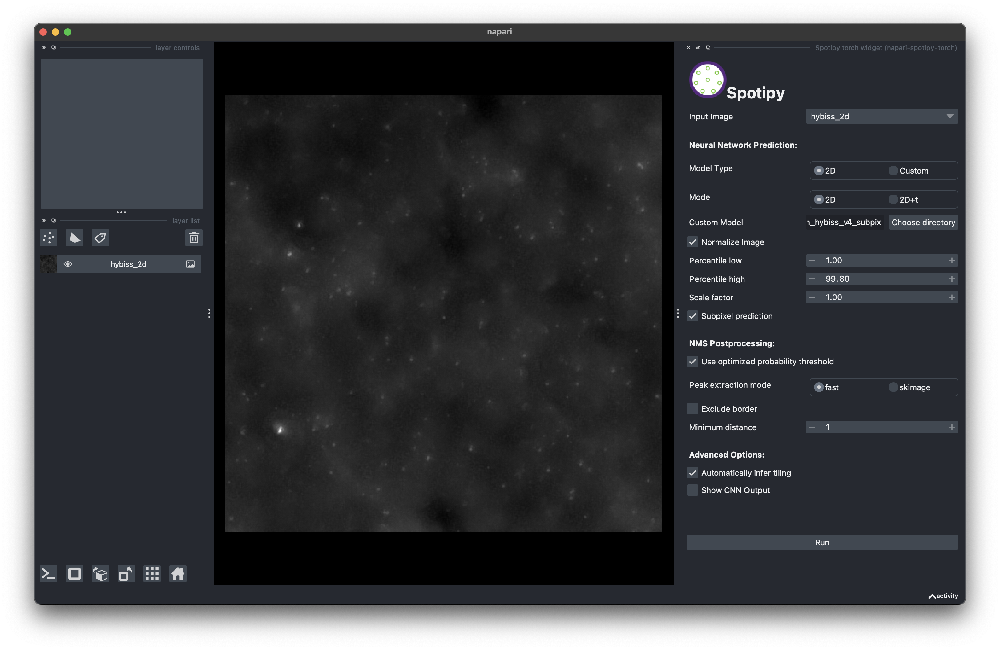

Predicting spots using the napari plugin
----------------------------------------

The napari plugin can be used to predict spots in a napari viewer. First, you must install it in the environment containing Spotiflow:

.. code-block:: console

    (spotiflow) $ pip install napari-spotiflow

The plugin will then be available in the napari GUI under the name "Spotiflow widget". This is how the GUI looks like:

The plugin allows running on two modes: for images (``2D``) and volumes (``3D``), which can be toggled using the corresponding  buttons in the GUI. You can also run on movies by setting the appropriate axis order (should be leading with a `T`).

Upon pressing the button ``Run``, The plugin will create a ``Points`` layer containing the predicted spots:

.. image:: ./_static/spotiflow_napari_preds.png
    :width: 700
    :align: center

If the option ``Show CNN output`` is checked, the plugin will also create two ``Image`` layers containing the heatmap output of the CNN as well as the stereographic flow.

Finally, the plugin includes two sample 2D images (HybISS and Terra) as well as a synthetic 3D volume. These samples can be loaded from the ``File`` menu (``File -> Open sample -> napari-spotiflow``). You can try the plugin with these samples to get a better idea of how it works!